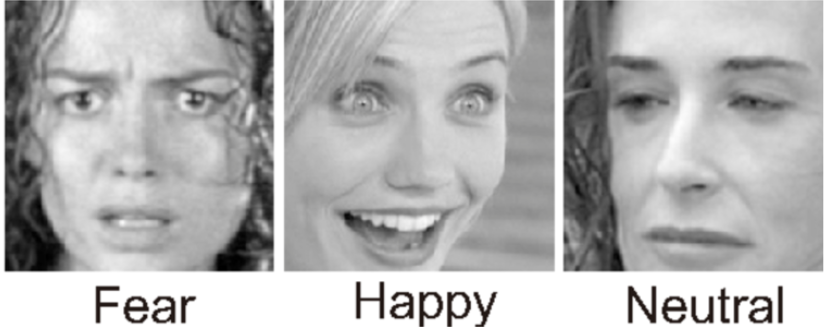

# Emotion-detection-
Aim of this project is to create a model which can efficiently detect emotion portrayed from images.
Model is trained and tested on FER-2013 dataset (one of the most challenging dataset out there) which contains 28,709 train and 3,589 test images divided among seven categories (0=Angry, 1=Disgust, 2=Fear, 3=Happy, 4=Sad, 5=Surprise, 6=Neutral).
Sample emotions are shown in the image below:

Major challenge faced is small image size 48*48, which inhibits training very deep models. Lower resoltion image also means that less information is available, especially along boundaries (such as mouth, eyes etc.) which are main focus for emotion detection.

# Methodology 
Denoising is performed using fourier transform then scaled using minmaxscaler to make it input ready for the model.
Model utilizes convolution layers for feature extraction, dropout layers for regularization, pooling layers, batchnormalization and a skip connection added to avoid disappearing gradients and loss of information.

# Results
Model achieved an accuracy of 71.26% which is impressive considering that max accuracy ever achieved on the model is 75.2%
